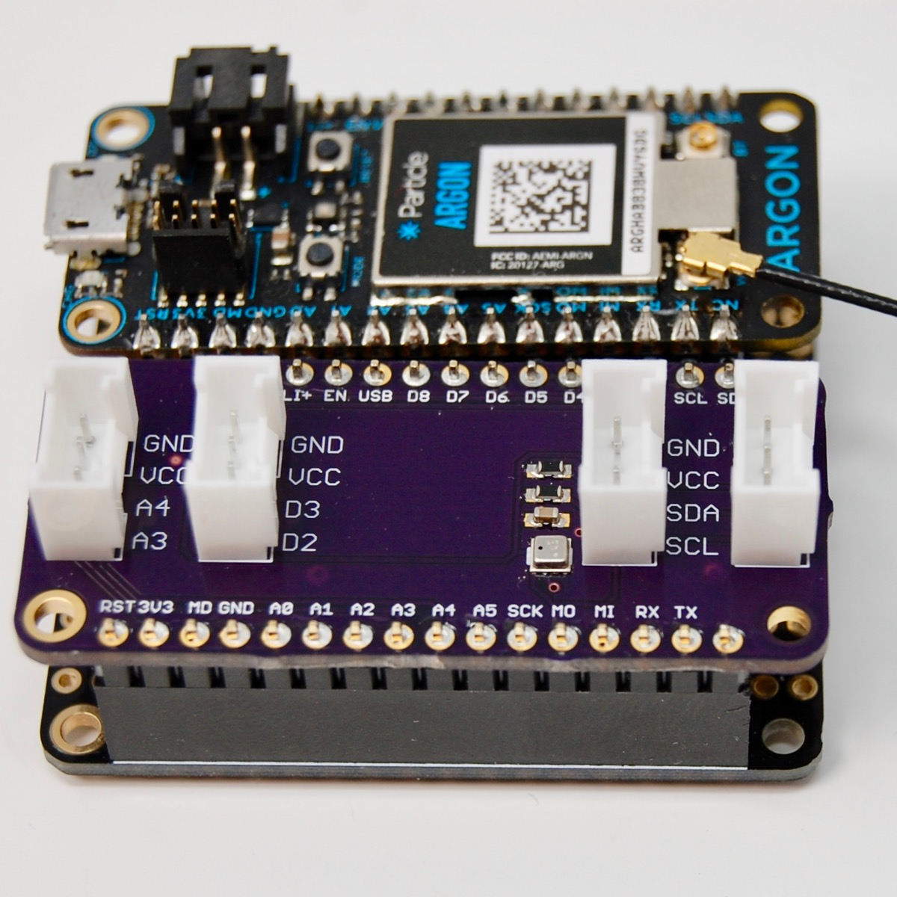
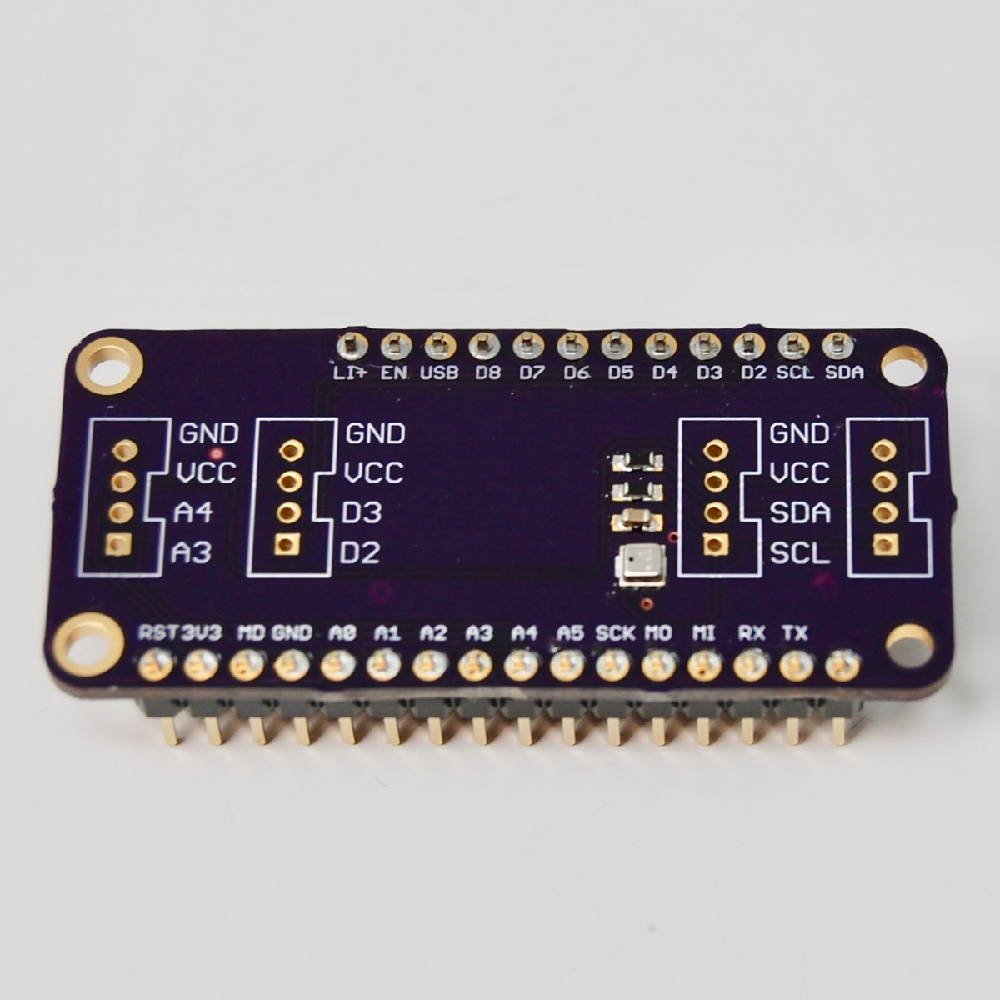
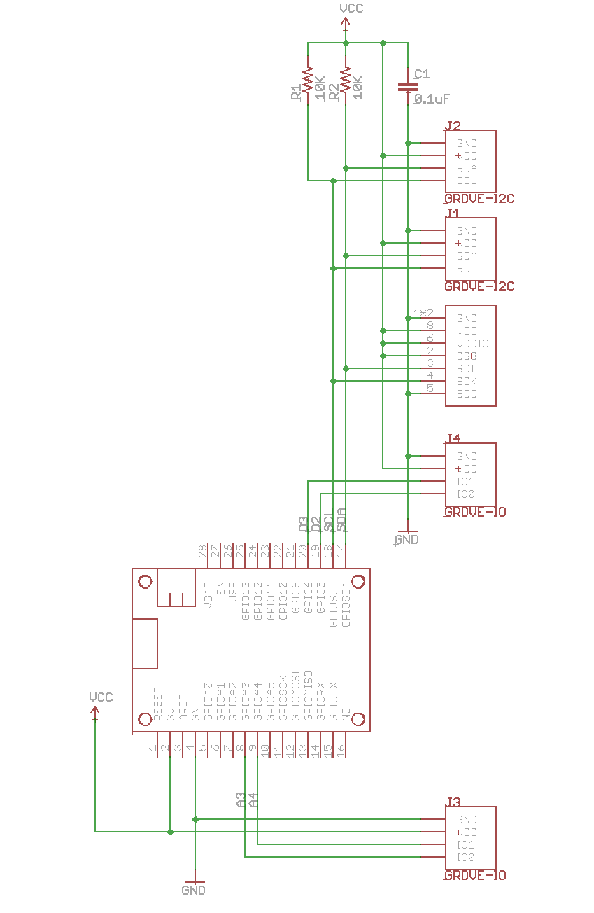

# BME280 FeatherWing with Grove

*FeatherWing with a BME280 temperature, humidity, and pressure sensor. And Grove connectors.*



This is a simple board that includes a BME280 temperature, humidity, and pressure sensor, connected by I2C (pins D0 and D1). Since the chip is really tiny, it also includes [Grove connectors](http://wiki.seeedstudio.com/Grove_System/) so you can attach other analog, digital, or I2C sensors with a 4-pin Grove cable.





## What You Need

This is a somewhat advanced project mainly because the BME280 is tiny and has pads on the bottom of the module, making it impossible to solder by hand. You'll need a SMD reflow oven to do it effectively.

- Circuit boards (I order them from [OshPark](https://oshpark.com))
- Stencil (this board can be assembled without one, but I order them from [OshStencils](https://oshstencils.com))
- Solder paste
- Reflow oven (the inexpensive [T962](https://www.amazon.com/dp/B01LZYEF90/ref=dp_prsubs_1) works fine)
- Soldering iron (for the header pins and Grove connectors)
- Regular solder

## Eagle Directory

- FeatherBME280.sch Schematic for Eagle CAD (also available in pdf)
- FeatherBME280.pdf Schematic in pdf
- FeatherBME280.brd Board Layout in Eagle CAD
- FeatherBME280.lbr Library file with all components in the board


## BOM

| Quantity | Item | Example |
| --- | --- | --- |
| 1 | 0.1µF capacitor 0603 | [Murata GRM188R71C104KA01D](https://www.digikey.com/product-detail/en/murata-electronics-north-america/GRM188R71C104KA01D/490-1532-1-ND/587771) |
| 2 | 10KΩ resistor 0603 | [Panasonic ERJ-PA3J103V](https://www.digikey.com/product-detail/en/panasonic-electronic-components/ERJ-PA3J103V/P10KBZCT-ND/5036237) | 
| 1 | BME280 | [BME280](https://www.digikey.com/product-detail/en/bosch-sensortec/BME280/828-1063-1-ND/6136314) |
| 4 | Grove Connectors | [Grove connector](https://www.digikey.com/product-detail/en/seeed-technology-co-ltd/110990030/1597-1082-ND/5482560) |
| | Male header pins 0.1" | [Sullins PRPC040SAAN-RC](https://www.digikey.com/product-detail/en/PRPC040SAAN-RC/S1011EC-40-ND/2775214) |

## Firmware

In order to use the BME280 sensor, you can use the [Adafruit\_BME280\_RK](https://github.com/rickkas7/Adafruit_BME280_RK) library. Follow the i2c_bme280 example as this board uses the BME280 in I2C mode.

Example:

```
#include "Adafruit_BME280_RK.h"

#define SEALEVELPRESSURE_HPA (1013.25)

Adafruit_BME280 bme; // I2C

unsigned long delayTime;

void printValues();

void setup() {
    Serial.begin(9600);
    Serial.println("BME280 test");

    bool status;
    
    // Address is either 0x76 or 0x77. If omitted, the default is 0x77.
    status = bme.begin(0x76);
    if (!status) {
        Serial.println("Could not find a valid BME280 sensor, check wiring!");
        while (1);
    }
    
    Serial.println("-- Default Test --");
    delayTime = 1000;

    Serial.println();
}


void loop() { 
    printValues();
    delay(delayTime);
}


void printValues() {
    Serial.print("Temperature = ");
    Serial.print(bme.readTemperature());
    Serial.println(" *C");

    Serial.print("Pressure = ");

    Serial.print(bme.readPressure() / 100.0F);
    Serial.println(" hPa");

    Serial.print("Approx. Altitude = ");
    Serial.print(bme.readAltitude(SEALEVELPRESSURE_HPA));
    Serial.println(" m");

    Serial.print("Humidity = ");
    Serial.print(bme.readHumidity());
    Serial.println(" %");

    Serial.println();
}

```


